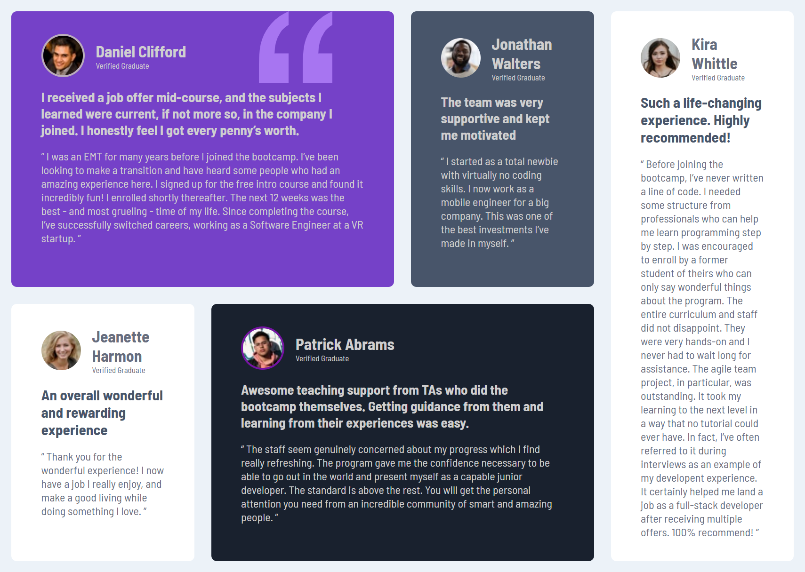

# Frontend Mentor - Testimonials grid section solution

This is my solution to the Testimonials Grid Section Challenge on Frontend Mentor. It helped me improve my responsive design skills and deepen my understanding of the CSS Grid system.

## Table of contents

- [Overview](#overview)
  - [The challenge](#the-challenge)
  - [Screenshot](#screenshot)
  - [Links](#links)
- [My process](#my-process)
  - [Built with](#built-with)
  - [What I learned](#what-i-learned)
  - [Continued development](#continued-development)
- [Author](#author)
- [Acknowledgments](#acknowledgments)

## Overview

### The challenge

Users should be able to:

- View the optimal layout for the site depending on their device's screen size

### Screenshot

### Links

- Solution URL: [solution URL ](https://www.frontendmentor.io/solutions/testimonials-grid-section-dPAZdEz43a)
- Live Site URL: [Live site](https://testimonials-grid-section-main-nine-alpha.vercel.app/)

## My process

### Built with

- Built With
- Semantic HTML5
- CSS Grid layout
- Mobile-first responsive design

### What I learned

While building this project, I gained a deeper understanding of the CSS Grid system and how to use its attributes effectively to build a responsive layout. I practiced setting up grid containers, using properties like grid-template-columns, grid-template-areas, and gap, and adjusting layouts based on screen sizes.

I also ensured that the project is fully mobile responsive, adapting the layout seamlessly from mobile to desktop using media queries and the grid system.

Example CSS snippet I used:

.testimonials-grid{
    max-width: 1440px;
    margin: 1rem;
    display: grid;
    grid-template-areas: 
    "item1 item1 item2 item3"
    "item4 item5 item5 item3";
    grid-auto-columns: 1fr;
    gap: 1.5rem;
}

### Continued development

This project helped me understand how to:

Use CSS Grid to create flexible, clean layouts

Adjust grid columns and rows for different screen sizes using media queries

Apply mobile-first design principles to build a responsive and user-friendly layout

## Author

- Frontend Mentor - [@Rhuqayah001](https://www.frontendmentor.io/profile/Rhuqayah001)
- LinkedIn - [@Fashina Rukayat](https://www.linkedin.com/in/fashina-rukayat-001bb2332/)

## Acknowledgments

Thanks to the Frontend Mentor community and everyone sharing helpful tips and code reviews. Your projects and feedback inspired me!